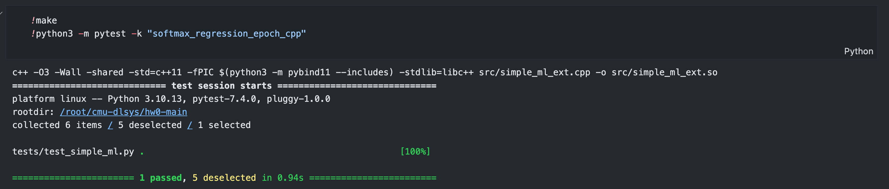

# CMU-DL System Lab0 实验记录

[CMU-DL System](https://dlsyscourse.org/assignments)是陈天奇教授的课程，旨在揭示ML系统的核心原理、配合一些高质量的assignment

# Lab0: 课前自测

Lab0 给出了一些测试题目，这些测试题目有助于学习者衡量自己的背景是否能够满足完成这些课程的前置条件。

首先需要去Github上克隆Lab0，地址是：

克隆完成后我们可以看到主要的目录结构为：

```Bash
data/
	train-images-idx3-ubyte.gz
	train-labels-idx1-ubyte.gz
	t10k-images-idx3-ubyte.gz
	t10k-labels-idx1-ubyte.gz
src/
	simple_ml.py
	simple_ml_ext.cpp
tests/
	test_simple_ml.py
Makefile
```

## Q1: 实现add方法

首先需要在 `simple_ml.py` 中实现一个简单的add方法，已给出的骨架如下：

```python
def add(x, y):
    """ A trivial 'add' function you should implement to get used to the 
    autograder and submission system.  The solution to this problem is in
    the homework notebook.

    Args:
        x (Python number or numpy array)
        y (Python number or numpy array)

    Return:
        Sum of x + y
    """
    ### YOUR CODE HERE
    pass
    ### END YOUR CODE
```

实现非常简单，直接相加就可以了

```Python
def add(x, y):
	...

	### BEGIN YOUR CODE

	return x + y

	### END YOUR CODE
```

## Q2:  加载Minist数据集


```python
import gzip
import numpy as np

def parse_mnist(image_filename, label_filename):
    # 打开并解压缩图像文件
    with gzip.open(image_filename, 'rb') as image_file:
        # 读取文件头，跳过前16字节
        image_file.read(16)
        # 读取图像数据
        image_data = image_file.read()

    # 打开并解压缩标签文件
    with gzip.open(label_filename, 'rb') as label_file:
        # 读取文件头，跳过前8字节
        label_file.read(8)
        # 读取标签数据
        label_data = label_file.read()

    # 将图像和标签数据转换为NumPy数组
    image_array = np.frombuffer(image_data, dtype=np.uint8)
    label_array = np.frombuffer(label_data, dtype=np.uint8)

    # 获取图像的维度
    num_images = len(label_array)
    image_dim = len(image_array) // num_images

    # 将图像数据转换为浮点数并归一化
    image_array = image_array.astype(np.float32) / 255.0

    # 返回图像数据和标签数据的元组
    return image_array.reshape(num_images, image_dim), label_array

```

## Q3: 实现SoftMax Loss

在 `src/simple_ml.py`文件中实现softmax损失（又名交叉熵损失）函数，即 `softmax_loss()`函数。回顾一下（希望这是复习，但我们也会在9月1日的课上讲解），对于可以取值 $y \in \{1,\ldots,k\}$的多类输出，softmax损失函数接受一个向量 $z \in \mathbb{R}^k$作为输入，这个向量包含了对数概率，以及一个真实的类$y \in \{1,\ldots,k\}$，返回定义如下的损失：

$$
\ell_{\mathrm{softmax}}(z, y) = \log\sum_{i=1}^k \exp z_i - z_y.
$$

请注意，正如其文档字符串中所描述的，`softmax_loss()`接受一个_二维数组_的logits（即，一个批次中不同样本的 \( k \) 维logits），以及一个相应的一维数组的真实标签，应该输出整个批次的_softmax损失的平均值_。请注意，为了正确执行这一计算，你应该_不使用任何循环_，而是完全使用numpy的向量化操作（为了设定期望值，我们应该注意到我们的参考解决方案由一行代码组成）。

请注意，对于“真实”的softmax损失实现，你会希望对logits进行缩放以防止数值溢出，但在这里我们不需要担心这个问题（即使你不考虑这个问题，剩余的作业也能正常工作）。下面的代码运行测试用例。

```Python
def softmax_loss(Z, y):
    """ Return softmax loss.  Note that for the purposes of this assignment,
    you don't need to worry about "nicely" scaling the numerical properties
    of the log-sum-exp computation, but can just compute this directly.

    Args:
        Z (np.ndarray[np.float32]): 2D numpy array of shape
            (batch_size, num_classes), containing the logit predictions for
            each class.
        y (np.ndarray[np.uint8]): 1D numpy array of shape (batch_size, )
            containing the true label of each example.

    Returns:
        Average softmax loss over the sample.
    """
    # BEGIN YOUR CODE
    pass
    # END YOUR CODE
```

## 问题4：Softmax回归的随机梯度下降

在这个问题中，您将为(线性)Softmax回归实现随机梯度下降（SGD）。换句话说，正如我们在9月1日的课上讨论的，我们将考虑一个假设函数，它通过下面的函数将$n$维输入转换为$k$维的对数几率（logits）：

$$
h(x) = \Theta^T x
$$

其中 $x \in \mathbb{R}^n$ 是输入，而 $\Theta \in \mathbb{R}^{n \times k}$ 是模型参数。给定一个数据集 $\{(x^{(i)} \in \mathbb{R}^n, y^{(i)} \in \{1,\ldots,k\})\}$，对于 $i=1,\ldots,m$，与Softmax回归相关的优化问题由下面给出：

$$
\DeclareMathOperator*{\minimize}{minimize}
\minimize_{\Theta} \; \frac{1}{m} \sum_{i=1}^m \ell_{\mathrm{softmax}}(\Theta^T x^{(i)}, y^{(i)}).
$$

回想一下课堂上的内容，线性Softmax目标的梯度由下面给出：

$$
\nabla_\Theta \ell_{\mathrm{softmax}}(\Theta^T x, y) = x (z - e_y)^T
$$

其中

$$
z = \frac{\exp(\Theta^T x)}{1^T \exp(\Theta^T x)} \equiv \text{normalize}(\exp(\Theta^T x))
$$

（即，$z$只是归一化的Softmax概率），并且$e_y$表示第$y$个单位基，也就是，在第$y$个位置是1，其他位置都是0的向量。

我们也可以用我们在课堂上讨论过的更紧凑的表示法来表达这一点。也就是说，如果我们让$X \in \mathbb{R}^{m \times n}$表示某$m$个输入的设计矩阵（不论是整个数据集还是一个小批次），$y \in \{1,\ldots,k\}^m$对应的标签向量，以及重载$\ell_{\mathrm{softmax}}$来指代平均Softmax损失，那么

$$
\nabla_\Theta \ell_{\mathrm{softmax}}(X \Theta, y) = \frac{1}{m} X^T (Z - I_y)
$$

其中

$$
Z = \text{normalize}(\exp(X \Theta)) \quad \text{（归一化应用于逐行）}
$$

表示对数几率矩阵，而$I_y \in \mathbb{R}^{m \times k}$代表$y$中标签的独热编码的合并。

使用这些梯度，实现 `softmax_regression_epoch()`函数，该函数使用指定的学习率/步长 `lr`和小批次大小 `batch`运行SGD的单个周期（一次数据集的传递）。如文档字符串所描述的，您的函数应该就地修改 `Theta`数组。实现后，运行测试。

```Python
def softmax_regression_epoch(X, y, theta, lr=0.1, batch=100):
    """ Run a single epoch of SGD for softmax regression on the data, using
    the step size lr and specified batch size.  This function should modify the
    theta matrix in place, and you should iterate through batches in X _without_
    randomizing the order.

    Args:
        X (np.ndarray[np.float32]): 2D input array of size
            (num_examples x input_dim).
        y (np.ndarray[np.uint8]): 1D class label array of size (num_examples,)
        theta (np.ndarrray[np.float32]): 2D array of softmax regression
            parameters, of shape (input_dim, num_classes)
        lr (float): step size (learning rate) for SGD
        batch (int): size of SGD minibatch

    Returns:
        None
    """
    num_examples = X.shape[0]
    for start_idx in range(0, num_examples, batch):
        end_idx = min(start_idx + batch, num_examples)
        X_batch = X[start_idx:end_idx]
        y_batch = y[start_idx:end_idx]
  
        # Compute logits for the current batch
        logits = np.dot(X_batch, theta)
  
        # Compute softmax gradient
        grad = softmax_grad(logits, y_batch)
  
        # Update the Theta parameters
        theta -= lr * np.dot(X_batch.T, grad)
```

## 问题 5: 两层神经网络的随机梯度下降（SGD）

既然您已经为线性分类器编写了随机梯度下降（SGD），现在让我们考虑一个简单的两层神经网络的情况。具体来说，对于输入 \( x \in \mathbb{R}^n \)，我们将考虑一个没有偏置项的两层神经网络，形式如下：

$$
z = W_2^T \mathrm{ReLU}(W_1^T x)
$$

这里 \( W_1 \in \mathbb{R}^{n \times d} \) 和 \( W_2 \in \mathbb{R}^{d \times k} \) 表示网络的权重（网络具有一个 \( d \) 维的隐藏单元），而 \( z \in \mathbb{R}^k \) 表示网络输出的logits。我们再次使用softmax/交叉熵损失，意味着我们想要解决以下优化问题：

$$
\minimize_{W_1, W_2} \;\; \frac{1}{m} \sum_{i=1}^m \ell_{\mathrm{softmax}}(W_2^T \mathrm{ReLU}(W_1^T x^{(i)}), y^{(i)}).
$$

或者，使用矩阵 \( X \in \mathbb{R}^{m \times n} \) 来描述批量形式的情况，也可以写成：

$$
\minimize_{W_1, W_2} \;\; \ell_{\mathrm{softmax}}(\mathrm{ReLU}(X W_1) W_2, y).
$$

使用链式法则，我们可以推导出这个网络的反向传播更新（我们将在9/8的课上简要介绍，但为了便于实现，这里也提供了最终形式）。具体来说，设：

$$
\begin{split}
Z_1 \in \mathbb{R}^{m \times d} & = \mathrm{ReLU}(X W_1) \\
G_2 \in \mathbb{R}^{m \times k} & = \normalize(\exp(Z_1 W_2)) - I_y \\
G_1 \in \mathbb{R}^{m \times d} & = \mathrm{1}\{Z_1 > 0\} \circ (G_2 W_2^T)
\end{split}
$$

这里 \( \mathrm{1}\{Z_1 > 0\} \) 是一个二元矩阵，其元素等于零或一，这取决于 \( Z_1 \) 中的每一项是否严格为正，且 \( \circ \) 表示按元素乘法。那么目标的梯度由下式给出：

$$
\begin{split}
\nabla_{W_1} \ell_{\mathrm{softmax}}(\mathrm{ReLU}(X W_1) W_2, y) & = \frac{1}{m} X^T G_1  \\
\nabla_{W_2} \ell_{\mathrm{softmax}}(\mathrm{ReLU}(X W_1) W_2, y) & = \frac{1}{m} Z_1^T G_2.  \\
\end{split}
$$

使用这些梯度，现在编写 `src/simple_ml.py` 文件中的 `nn_epoch()` 函数。与前一个问题一样，您的解决方案应该就地修改 `W1` 和 `W2` 数组。实现函数后，运行以下测试。请务必使用上述表达式所指示的矩阵操作来实现函数：这将比尝试使用循环_快得多_，而且效率更高（而且需要的代码远远少）。

在上述的课程描述中，已经非常完备的给出了对应的公式，对照着进行实现即可。

```Python
def nn_epoch(X, y, W1, W2, lr=0.1, batch=100):
    """ Run a single epoch of SGD for a two-layer neural network defined by the
    weights W1 and W2 (with no bias terms):
        logits = ReLU(X * W1) * W2
    The function should use the step size lr, and the specified batch size (and
    again, without randomizing the order of X).  It should modify the
    W1 and W2 matrices in place.

    Args:
        X (np.ndarray[np.float32]): 2D input array of size
            (num_examples x input_dim).
        y (np.ndarray[np.uint8]): 1D class label array of size (num_examples,)
        W1 (np.ndarray[np.float32]): 2D array of first layer weights, of shape
            (input_dim, hidden_dim)
        W2 (np.ndarray[np.float32]): 2D array of second layer weights, of shape
            (hidden_dim, num_classes)
        lr (float): step size (learning rate) for SGD
        batch (int): size of SGD minibatch

    Returns:
        None
    """
    num_examples = X.shape[0]
    num_classes = W2.shape[1]
  
    # Convert y to one-hot encoding
    y_one_hot = np.eye(num_classes)[y]
  
    for start_idx in range(0, num_examples, batch):
        end_idx = min(start_idx + batch, num_examples)
        X_batch = X[start_idx:end_idx]
        y_batch = y_one_hot[start_idx:end_idx]
  
        # Forward pass
        Z1 = ReLU(X_batch @ W1)  # Activation from first layer
        logits = Z1 @ W2  # Logits for the current batch
        probabilities = softmax(logits)
  
        # Compute the gradients for softmax loss
        G2 = probabilities - y_batch  # Gradient for softmax/cross-entropy layer
        G1 = (Z1 > 0).astype(float) * (G2 @ W2.T)  # Gradient for ReLU layer
  
        # Compute the gradients for weights
        grad_W1 = (X_batch.T @ G1) / batch
        grad_W2 = (Z1.T @ G2) / batch
  
        # Update the weights
        W1 -= lr * grad_W1
        W2 -= lr * grad_W2
```

## Q6: 用C++实现Softmax Regression

使用C++重写一遍问题4。由于使用的是原生的C++，因此有很多的代码需要重新写，下面是题目出给出的代码。

```cpp
void softmax_regression_epoch_cpp(const float *X, const unsigned char *y, 
								  float *theta, size_t m, size_t n, size_t k, 
								  float lr, size_t batch)
{
    /**
     * A C++ version of the softmax regression epoch code.  This should run a 
     * single epoch over the data defined by X and y (and sizes m,n,k), and
     * modify theta in place.  Your function will probably want to allocate
     * (and then delete) some helper arrays to store the logits and gradients.
     * 
     * Args:
     *     X (const float *): pointer to X data, of size m*n, stored in row 
     *          major (C) format
     *     y (const unsigned char *): pointer to y data, of size m
     *     theta (float *): pointer to theta data, of size n*k, stored in row
     *          major (C) format
     *     m (size_t): number of examples
     *     n (size_t): input dimension
     *     k (size_t): number of classes
     *     lr (float): learning rate / SGD step size
     *     batch (int): SGD minibatch size
     * 
     * Returns:
     *     (None)
     */

    /// YOUR CODE HERE
  
    /// END YOUR CODE
}
```

根据问题四的思路，主要步骤分为三步：

1. 根据小批量，计算得到logits
2. 计算梯度
3. 根据梯度更新参数

因此我们应该可以写出如下代码框架

```cpp
// 定义softmax回归训练迭代的函数
// 输入参数包括：特征矩阵X，目标值数组y，参数矩阵theta，样本数量m，特征数量n，类别数量k，
// 学习率lr，以及每批处理的样本数量batch
void softmax_regression_epoch_cpp(const float *X, const unsigned char *y,
                                  float *theta, size_t m, size_t n, size_t k,
                                  float lr, size_t batch)
{
    // 为logits（逻辑函数的输出）和梯度分配内存空间
    std::vector<float> logits(batch * k);
    std::vector<float> gradients(batch * k);

    // 通过迭代处理每个批次的样本
    for (size_t i = 0; i < m; i += batch) {
        // 确定当前批次的实际大小（处理最后一个批次时可能不满）
        size_t current_batch_size = std::min(batch, m - i);

        // 计算当前批次的logits。'X + i * n'定位到当前批次的第一个样本的特征数据起始点。
        dot_product(X + i * n, theta, logits.data(), current_batch_size, n, k);

        // 将原始logits数组的内容复制到std::vector中，以方便后续处理
        std::vector<float> logits_vector(logits.data(), logits.data() + current_batch_size * k);
  
        // 为当前批次初始化梯度向量
        std::vector<float> gradient_vector(current_batch_size * k);

        // 调用softmax_grad函数计算梯度
        softmax_grad(logits_vector, std::vector<unsigned char>(y + i, y + i + current_batch_size),
                     current_batch_size, k, gradient_vector);

        // 更新theta参数矩阵
        // 对于当前批次中的每个样本（由外循环j控制）
        for (size_t j = 0; j < current_batch_size; ++j) {
            // 对于每个类别（由中循环c控制）
            for (size_t c = 0; c < k; ++c) {
                // 对于每个特征（由内循环d控制）
                for (size_t d = 0; d < n; ++d) {
                    // 'theta[d * k + c]'是theta矩阵中对应于第d个特征对第c个类别的权重
                    // 它是一维数组中的索引，但代表二维矩阵的位置（d行c列）
                    // 'X[(i + j) * n + d]'是当前批次中第j个样本的第d个特征值
                    // 这个值与对应的梯度和学习率相乘后，用于更新theta矩阵的对应权重
                    // 这里进行的操作是梯度下降步骤，用于优化损失函数
                    theta[d * k + c] -= lr * gradient_vector[j * k + c] * X[(i + j) * n + d];
                }
            }
        }
    }
}

```

这个时候只需要完成两个函数dot_product、softmax_grad这两个函数的实现即可。下面给出参考的实现：

```cpp
void dot_product(const float* A, const float* B, float* C, size_t A_rows, size_t A_cols, size_t B_cols) {
    // Initialize C with zeros
    std::fill(C, C + A_rows * B_cols, 0.0f);

    // Compute the dot product
    for (size_t i = 0; i < A_rows; ++i) {            // Iterate over the rows of A
        for (size_t j = 0; j < B_cols; ++j) {        // Iterate over the columns of B
            for (size_t k = 0; k < A_cols; ++k) {    // Dot product calculation
                C[i * B_cols + j] += A[i * A_cols + k] * B[k * B_cols + j];
            }
        }
    }
}
```

```cpp
// Helper function to compute the softmax probabilities for a vector
std::vector<float> softmax(const std::vector<float>& logits) {
    std::vector<float> probabilities(logits.size());
    float max_logit = *std::max_element(logits.begin(), logits.end());
    float sum_exp = 0.0;

    for (size_t i = 0; i < logits.size(); ++i) {
        probabilities[i] = std::exp(logits[i] - max_logit);
        sum_exp += probabilities[i];
    }

    for (size_t i = 0; i < logits.size(); ++i) {
        probabilities[i] /= sum_exp;
    }

    return probabilities;
}

// Function to compute the gradient of the softmax loss
void softmax_grad(const std::vector<float>& Z, const std::vector<unsigned char>& y,
                  size_t batch_size, size_t num_classes, std::vector<float>& gradient) {
    std::vector<float> probabilities;

    // Compute softmax probabilities
    for (size_t i = 0; i < batch_size; ++i) {
        std::vector<float> logits(Z.begin() + i * num_classes, Z.begin() + (i + 1) * num_classes);
        std::vector<float> probs = softmax(logits);

        // Subtract 1 from the probability of the correct class
        probs[y[i]] -= 1;

        // Copy the probabilities back into the gradient vector
        std::copy(probs.begin(), probs.end(), gradient.begin() + i * num_classes);
    }

    // Average the gradient over the batch
    for (size_t i = 0; i < gradient.size(); ++i) {
        gradient[i] /= static_cast<float>(batch_size);
    }
}
```

最后运行测试函数



## 总结
