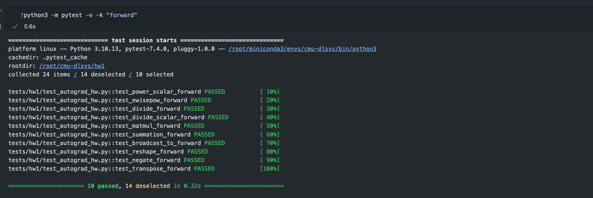
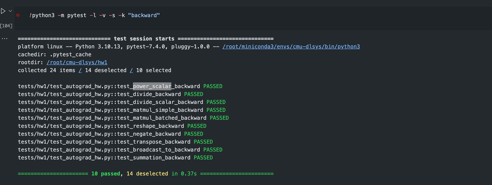

# 深度学习系统从入门到放弃 - CMU-DL System Lab1-1 前向计算和梯度传播

lab1开始正式进入到深度学习系统框架的开发，lab1将帮助你开始实现一个叫 **needle** （**ne**cessary **e**lements of **d**eep **le**arning）库。具体来说，lab1的目标是构建一个基本的**自动微分**框架，然后使用它来重新实现HW0中用于MNIST数字分类问题的简单双层神经网络。

# 什么是Neddle

`needle`是一个基于 `numpy` CPU后端的自动微分库，将在课程中逐步扩展到包含GPU代码的线性代数库。这次作业中，你将使用Python语言来实现自动微分的基础。

在 `needle`库中，有两个重要的文件：`python/needle/autograd.py`（定义了计算图框架的基础，并将成为自动微分框架的基础）和 `python/needle/ops/ops_mathematic.py`（包含各种运算符的实现，你将在作业和课程中使用这些运算符）。

虽然 `autograd.py`文件已经建立了自动微分的基本框架，但你应该熟悉库的基本概念，特别是以下几个定义的类：

- `Value`：在计算图中计算出的值，可以是对其他 `Value`对象应用的操作的输出，或者是常数（叶子）`Value`对象。这里使用了一个通用类（然后专门用于例如张量），以便于以后版本的needle中使用其他数据结构，但目前你主要通过它的子类 `Tensor`（见下文）与这个类交互。
- `Op`：计算图中的一个运算符。运算符需要在 `compute()`方法中定义它们的“前向”过程（即如何在 `Value`对象的底层数据上计算运算符），以及通过 `gradient()`方法定义它们的“反向”过程，即如何乘以传入的输出梯度。如何编写这样的运算符的细节将在下文中给出。
- `Tensor`：`Value`的一个子类，对应于计算图中的实际张量输出，即多维数组。你在这次作业中的所有代码（以及大多数后续作业）都将使用这个 `Value`的子类而不是上面的通用类。我们提供了几个便利函数（例如，操作符重载），让你能够使用正常的Python惯例操作张量，但这些函数在你实现相应操作之前将不会正常工作。
- `TensorOp`：是 `Op`的一个子类，用于返回张量的运算符。你在这次作业中实现的所有操作都将是这种类型。

# 问题1：实现前向计算

问题1中，我们将为多个类实现 `compute`方法以进行前向计算。例如，在 `ops/ops_mathematic.py`文件中的 `EWiseAdd`运算符，它的 `compute()`函数执行的是前向传播计算，即直接计算操作本身，输入为 `NDArray`对象。而 `gradient()`函数负责计算梯度，其参数为 `Tensor`对象，意味着函数内部的任何调用都应该通过 `TensorOp`运算来完成。另外，为了简化操作，定义了辅助函数 `add()`，以便更简洁地实现两个 `Tensor`对象的相加。以下是我们需要实现的运算符的 `compute`方法列表：

- `PowerScalar`：将输入提升至整数（标量）幂级。
- `EWiseDiv`：对输入进行逐元素的真除法（2个输入）。
- `DivScalar`：将输入逐元素地除以一个标量（1个输入，`scalar` - 数字）。
- `MatMul`：对输入进行矩阵乘法（2个输入）。
- `Summation`：在指定轴上对数组元素求和（1个输入，`axes` - 元组）。
- `BroadcastTo`：将数组广播到新的形状（1个输入，`shape` - 元组）。
- `Reshape`：不改变数据的前提下，为数组提供新的形状（1个输入，`shape` - 元组）。
- `Negate`：计算输入的数值负值，逐元素操作（1个输入）。
- `Transpose`：颠倒两个轴的顺序，默认为最后两轴（1个输入，`axes` - 元组）。

需要注意的是，由于在未来的作业中我们将使用 `numpy`以外的后端，这里将 `numpy`作为 `array_api`导入，所以我们需要调用 `array_api.add()`等函数，如果我们想使用典型的 `np.X()`调用的话。

## PowerScalar

`PowerScalar`类的 `compute`方法负责进行前向计算。具体地，它将输入的NDArray `a`提升到 `self.scalar`指定的整数幂。在Python的 `numpy`库中，这一计算可以直接通过 `numpy.power`函数实现。下面是对应的公式：

$$
a^{\text{scalar}}
$$

这里，`a`是输入的多维数组（NDArray），而 `scalar`是一个整数，表示我们要将 `a`的每个元素都提升到的幂次。

在代码中，这个计算被实现如下：

```python
def compute(self, a: NDArray) -> NDArray:
    return numpy.power(a, self.scalar)
```

## EWiseDiv

该类代表的操作是逐元素地将两个节点进行除法运算。

`compute`方法执行前向计算，它接收两个NDArray对象 `a`和 `b`作为输入，并返回它们逐元素相除的结果。逐元素除法意味着输出数组中的每个元素是输入数组对应元素的商。在 `numpy`中，这可以简单地使用 `/`运算符完成。

下面是对应的Markdown格式公式：

$$
a_i / b_i
$$

这里 `a_i`和 `b_i`是数组 `a`和 `b`中的对应元素。在代码中，`compute`方法被实现为：

```python
def compute(self, a, b):
    return a / b
```

## DivScalar

`DivScalar`类实现了将一个张量 `a`的每个元素除以一个标量 `scalar`的操作。这在数学上表示为将张量 `a`的每个元素 `a_i`除以 `scalar`：

$$
\frac{a_i}{\text{scalar}}
$$

在 `compute`方法中，我们使用了这个简单的数学操作。这在代码中被实现为：

```python
def compute(self, a):
    return a / self.scalar
```

这里，`a`是一个NDArray对象，`self.scalar`是初始化 `DivScalar`类时传入的标量值。

## MatMul

`MatMul`类的 `compute`方法实现了两个矩阵 `a`和 `b`之间的矩阵乘法。矩阵乘法是线性代数中的一项基础操作，其中每个元素都是第一个矩阵的行与第二个矩阵的列的点积。在Python中，这可以使用 `@`运算符来简化实现：

$$
\mathbf{C} = \mathbf{A} @ \mathbf{B}
$$

这里，$\mathbf{A}$和$\mathbf{B}$是输入矩阵，$\mathbf{C}$是结果矩阵。在代码中，`compute`方法被实现为：

```python
def compute(self, a, b):
    return a @ b
```

## Summation

`Summation`类实现了对张量进行求和的操作。这个类的方法 `compute`负责执行实际的求和计算。

如果在初始化 `Summation`对象时没有指定 `axes`参数，则默认对张量 `a`的所有元素进行全局求和。如果指定了 `axes`，则仅对指定轴上的元素进行求和。

`compute`方法根据是否指定了 `axes`来决定求和的方式：

- **全局求和**：如果 `self.axes`为 `None`，则对张量 `a`的所有元素进行求和。
- **指定轴求和**：如果指定了 `self.axes`，则只在这些特定的轴上进行求和。

代码实现如下：

```python
def compute(self, a):
    if self.axes is None:
        return array_api.sum(a)
  
    return array_api.sum(a, axis=self.axes)
```

在这段代码中，`array_api.sum`是执行求和操作的函数，`a`是输入的张量，`self.axes`是一个轴的元组，指示了求和操作的维度。

## BroadcastTo

`BroadcastTo`类设计用来扩展张量的形状，使其符合某个新的形状。这种操作在深度学习中常见，如需要将小规模数据扩展以与大规模数据进行操作时。

`compute`方法负责执行实际的广播操作，其使用了 `array_api.broadcast_to`函数。这个函数将输入的张量 `a`扩展到 `self.shape`定义的新形状。

- 如果 `a`的形状可以在不复制数据的前提下扩展到 `self.shape`，则进行广播。
- 如果 `a`的形状不能广播到 `self.shape`，通常会抛出一个异常。

代码实现如下：

```python
def compute(self, a):
    return array_api.broadcast_to(a, shape=self.shape)
```

在这段代码中，`a`是输入的张量，`self.shape`是要广播到的目标形状。通过这种方式，`BroadcastTo`操作允许不同形状的张量在数学运算中兼容。

## Reshape

`Reshape`类用于改变输入张量 `a`的形状而不改变其数据。这在数据预处理或网络层之间传递数据时特别有用，当你需要改变数据的维度以适应特定操作时。`compute`方法执行实际的形状改变操作。它依赖于 `array_api.reshape`函数，该函数接受原始张量 `a`和一个目标形状 `self.shape`作为参数，并返回一个新形状的张量。

代码实现如下：

```python
def compute(self, a):
    return array_api.reshape(a, self.shape)
```

这里，`a`是输入张量，`self.shape`是我们想要 `a`重新塑形成的新形状。`Reshape`操作确保了张量 `a`的总元素数量保持不变，同时允许我们以新的维度排列这些元素。

## Negate

`Negate`类实现了数值取反操作，即将输入张量 `a`中的所有元素的符号颠倒。在数学和编程中，取反是一个基本操作，通常用于改变数值的正负。`compute`方法负责执行取反操作。它使用了 `array_api.negative`函数，这个函数接受输入张量 `a`，并返回一个新张量，新张量的每个元素都是 `a`中对应元素的负值。

代码实现如下：

```python
def compute(self, a):
    return array_api.negative(a)
```

在这段代码中，`a`是输入张量。执行 `array_api.negative(a)`后，我们得到一个新的张量，其中包含了 `a`的数值取反后的结果。这个操作在梯度计算和优化中特别有用，因为它常常涉及到梯度的方向反转。

## Transpose

该操作可以交换多维数组中任意两个轴的位置。它的目的是转置输入的多维数组 `a`。转置操作通常意味着在矩阵（二维数组）中交换行和列，但在多维数组中，转置可以更一般化为交换任意两个维度。

代码首先检查是否有 `self.axes`提供，`self.axes`是一个包含两个元素的元组，指定了需要交换的轴。如果没有提供 `self.axes`，则默认交换数组的最后两个轴。这在多维数组的线性代数操作中是常见的，特别是在执行矩阵乘法时。

如果提供了 `self.axes`，则代码根据提供的轴创建一个新的轴顺序。然后使用 `array_api.transpose`函数执行转置，这个函数接收数组 `a`和轴顺序 `axes_to_use`作为参数。

转置操作可以用下面的伪代码来描述：

```markdown
# 如果未提供axes，使用默认的最后两个轴
if axes is None:
    transpose(a, axes=(-2, -1))
# 如果提供了axes，使用指定的轴
else:
    transpose(a, axes=(axes[0], axes[1]))
```

在实际的Python代码中，这个逻辑是这样实现的：

```python
def compute(self, a):
    if self.axes is None:
        axes_to_use = list(range(a.ndim))
        axes_to_use[-2], axes_to_use[-1] = axes_to_use[-1], axes_to_use[-2]
    else:
        axes_to_use = list(range(a.ndim))
        axes_to_use[self.axes[0]], axes_to_use[self.axes[1]] = axes_to_use[self.axes[1]], axes_to_use[self.axes[0]]
  
    return array_api.transpose(a, axes=axes_to_use)
```

在这段代码中，`a.ndim`表示数组 `a`的维度数，`list(range(a.ndim))`创建了一个从0到 `a.ndim - 1`的整数列表，代表了数组 `a`的原始轴顺序。接下来，通过交换列表中的两个元素，我们得到了新的轴顺序，然后传递给 `array_api.transpose`函数来实际执行转置操作。

## 执行结果

执行全部通过✅



# 问题2：实现反向计算

## 必要的背景知识

主要是基于链式法则，但在此之前，让我们先看看几个数据结构，主要是 `Tensor` 和 `Value`。

`python/needle/autograd.py` 中定义了一个名为 `Value` 的类，它代表了一个计算图中的节点。这个类的设计目的是用于自动微分系统或者深度学习框架中，以跟踪和计算梯度。以下是该类的一些主要特点和方法：

- **属性**:

  - `op`：一个可选的 `Op` 类型，代表与该值相关的操作。
  - `inputs`：一个 `Value` 类型的列表，表示计算当前值所需的输入值列表。
  - `cached_data`：一个缓存数据，用于存储节点的当前值，避免重复计算。
  - `requires_grad`：一个布尔值，指示该值是否需要计算梯度。
- **方法**:

  - `realize_cached_data`：计算或获取缓存的数据。如果 `cached_data` 不为空，则直接返回缓存的数据，否则使用 `op` 的 `compute` 方法和输入值列表来计算数据。
  - `is_leaf`：判断该值是否是叶节点，即没有 `op` 的值。
  - `__del__`：析构方法，用于更新全局的 `TENSOR_COUNTER`，在值被删除时减少计数器。
  - `_init`：初始化方法，用于设置 `op`、`inputs`、`num_outputs`、`cached_data` 和 `requires_grad`。如果 `requires_grad` 没有明确提供，它会根据输入值的 `requires_grad` 属性确定。
  - `make_const`：类方法，用于创建一个常量值，即没有操作和输入的值。
  - `make_from_op`：类方法，用于根据操作和输入列表创建一个 `Value` 对象。如果不在懒惰模式下（`LAZY_MODE` 为假），并且该值不需要梯度，它会返回一个分离的值。否则，会立即计算缓存数据。

这个类的设计允许构建一个包含所有中间操作和值的计算图，使得可以自动地通过反向传播算法计算梯度。这是现代深度学习库如 PyTorch 和 TensorFlow 的基础。

 `Tensor` 的类，它是 `Value` 类的子类，用于实现深度学习框架中的张量操作。张量是一个多维数组，它是深度学习中数据表示的核心。`Tensor` 类提供了用于创建和操作这些多维数组的接口，同时支持自动梯度计算，以便用于反向传播。以下是该类的一些主要特点和方法：

| 类型                 | 名称                  | 描述                                               |
| -------------------- | --------------------- | -------------------------------------------------- |
| **属性**       | `grad`              | 存储梯度的张量。                                   |
| **构造函数**   | `__init__`          | 初始化张量，可指定数组、设备、数据类型和梯度需求。 |
| **静态方法**   | `_array_from_numpy` | 将 NumPy 数组转换为张量。                          |
|                      | `make_from_op`      | 根据操作和输入列表创建张量。                       |
|                      | `make_const`        | 创建一个常数张量。                                 |
| **属性访问器** | `data`              | 获取或设置张量数据。                               |
|                      | `shape`             | 返回张量形状。                                     |
|                      | `dtype`             | 返回数据类型。                                     |
|                      | `device`            | 返回数据所在的设备。                               |
| **方法**       | `detach`            | 创建一个共享数据但不参与梯度计算的新张量。         |
|                      | `backward`          | 启动反向传播计算梯度。                             |
|                      | `numpy`             | 将张量转换为 NumPy 数组。                          |
| **魔术方法**   | `__add__`等         | 重载算术操作符，支持直接的张量计算。               |
|                      | `__matmul__`        | 重载矩阵乘法操作符 `@`。                         |
|                      | `__neg__`           | 重载取负操作 `-`。                               |
| **其他方法**   | `sum`               | 计算和。                                           |
|                      | `broadcast_to`      | 广播张量到新形状。                                 |
|                      | `reshape`           | 改变张量形状。                                     |
|                      | `transpose`         | 转置张量。                                         |

## ElementWise Add：小例子

### 梯度计算方法

对于 `EWiseAdd` 操作，给定的输出梯度（`out_grad`）直接就是该操作对于每个输入张量的梯度。换句话说，如果我们有一个标量函数 \( L \) 是最终的损失函数，`a` 和 `b` 是 `EWiseAdd` 操作的输入，那么根据链式法则：

$$
\frac{\partial L}{\partial a} = \frac{\partial L}{\partial (a+b)} \cdot \frac{\partial (a+b)}{\partial a}
$$

因为 \( a + b \) 相对于 \( a \) 的导数是 1，我们可以简化为：

$$
\frac{\partial L}{\partial a} = \frac{\partial L}{\partial (a+b)}
$$

同理，对 \( b \) 也是如此：

$$
\frac{\partial L}{\partial b} = \frac{\partial L}{\partial (a+b)}
$$

因此，无论输入张量 `a` 和 `b` 的具体内容是什么，`EWiseAdd` 操作的梯度都是输出梯度（`out_grad`）自身。

### 在代码中的实现

```python
class EWiseAdd(TensorOp):
    def compute(self, a: NDArray, b: NDArray):
        # 直接返回输入张量a和b的逐元素求和结果
        return a + b

    def gradient(self, out_grad: Tensor, node: Tensor):
        # 返回与输出梯度相同的梯度给每一个输入节点
        return out_grad, out_grad
```

这段代码的 `gradient` 方法返回了一个元组 `(out_grad, out_grad)`，其中每个 `out_grad` 是传播到每个输入张量 `a` 和 `b` 的梯度。在自动微分的背景下，这意味着损失函数相对于 `EWiseAdd` 操作的每个输入的梯度，都是损失函数相对于该操作输出的梯度。

## PowerScalar

`PowerScalar` 算子接收一个整数标量 `scalar` 并将输入张量 `a` 的每个元素 \( a_i \) 乘以自身 `scalar` 次。其数学表达式为：

$$
a_i^{scalar}
$$

### 梯度计算

当我们需要对 `PowerScalar` 算子进行反向传播时，我们要计算关于输入 `a` 的梯度。根据链式法则，如果有一个标量函数 \( L \) 是最终的损失函数，那么 `a` 的梯度是：

$$
\frac{\partial L}{\partial a_i} = \frac{\partial L}{\partial (a_i^{scalar})} \cdot \frac{\partial (a_i^{scalar})}{\partial a_i}
$$

给定 \( a_i^{scalar} \) 相对于 \( a_i \) 的导数是 \( scalar \cdot a_i^{scalar - 1} \)，我们可以进一步展开上述表达式：

$$
\frac{\partial L}{\partial a_i} = \frac{\partial L}{\partial (a_i^{scalar})} \cdot scalar \cdot a_i^{scalar - 1}
$$

这意味着输入张量 `a` 中每个元素 \( a_i \) 的梯度是由外部传递的梯度（即 \( \frac{\partial L}{\partial (a_i^{scalar})} \)）乘以 `scalar` 再乘以 \( a_i \) 的 `scalar - 1` 次幂。

### 代码实现

```python
class PowerScalar(TensorOp):
    """Op raise a tensor to an (integer) power."""
  
    def __init__(self, scalar: int):
        self.scalar = scalar

    def compute(self, a: NDArray) -> NDArray:
        # 计算输入张量a的每个元素的scalar次幂
        return array_api.power(a, self.scalar)

    def gradient(self, out_grad: Tensor, node: Tensor):
        # 计算梯度
        return Tensor(out_grad * self.scalar * array_api.power(node, self.scalar - 1))
```

## EWiseDiv

`EWiseDiv` 算子按元素地将一个节点（张量） `a` 除以另一个节点 `b`。其数学表达式为：

$$
c_i = \frac{a_i}{b_i}
$$

其中 $c_i $ 是结果张量中的第 \( i \) 个元素。

### 梯度计算

为了在神经网络中反向传播误差，我们需要计算 `EWiseDiv` 操作相对于其两个输入的梯度。根据链式法则，如果有一个标量函数 \( L \) 是最终的损失函数，那么关于 `a` 和 `b` 的梯度分别是：

对于 \( a \)：

$$
\frac{\partial L}{\partial a_i} = \frac{\partial L}{\partial c_i} \cdot \frac{\partial c_i}{\partial a_i}
$$

因为 $ \frac{\partial c_i}{\partial a_i} = \frac{1}{b_i} $，所以：

$$
\frac{\partial L}{\partial a_i} = \frac{\partial L}{\partial c_i} \cdot \frac{1}{b_i}
$$

对于 \( b \)：

$$
\frac{\partial L}{\partial b_i} = \frac{\partial L}{\partial c_i} \cdot \frac{\partial c_i}{\partial b_i}
$$

由于 $ \frac{\partial c_i}{\partial b_i} = -\frac{a_i}{b_i^2} $，我们有：

$$
\frac{\partial L}{\partial b_i} = -\frac{\partial L}{\partial c_i} \cdot \frac{a_i}{b_i^2}
$$

### 代码实现

```python
class EWiseDiv(TensorOp):
    """Op to element-wise divide two nodes."""
  
    def compute(self, a, b):
        # 返回输入张量a和b的逐元素商
        return a / b

    def gradient(self, out_grad, node):
        a, b = node.inputs 
        # 对于a的梯度
        grad_a = out_grad / b
        # 对于b的梯度
        grad_b = -out_grad * a / array_api.power(b, 2)
        return Tensor(grad_a), Tensor(grad_b)
```

## DivScalar

`DivScalar` 算子将输入张量 `a` 的每个元素 $ a_i $ 除以一个标量值 `scalar`。其数学表达式为：

$$
c_i = \frac{a_i}{scalar}
$$

其中 $ c_i $ 是结果张量中的第 \( i \) 个元素。

### 梯度计算

对于 `DivScalar` 算子，我们需要计算它相对于输入张量 `a` 的梯度。根据链式法则，如果有一个标量函数 \( L \) 代表最终的损失函数，那么对于输入张量 `a` 中的每个元素 $a_i $ 的梯度是：

$$
\frac{\partial L}{\partial a_i} = \frac{\partial L}{\partial c_i} \cdot \frac{\partial c_i}{\partial a_i}
$$

由于 `scalar` 是一个常数，因此 $ \frac{\partial c_i}{\partial a_i} $ 的值为 $ \frac{1}{scalar} $。因此，我们得到：

$$
\frac{\partial L}{\partial a_i} = \frac{\partial L}{\partial c_i} \cdot \frac{1}{scalar}
$$

### 代码实现

```python
class DivScalar(TensorOp):
    def __init__(self, scalar):
        self.scalar = scalar

    def compute(self, a):
        # 返回输入张量a与标量scalar的商
        return a / self.scalar

    def gradient(self, out_grad: Tensor, node: Tensor):
        # 返回输入张量a的梯度
        return out_grad * (1 / self.scalar)
```

## MatMul

在神经网络中，矩阵乘法是一个基础且常用的运算，用于层之间的线性变换。`MatMul` 算子实现了两个张量的矩阵乘法。对于梯度的计算，特别是当涉及到批处理和不同维度的张量时，需要特别处理以保证梯度的形状与原张量匹配。

`MatMul` 算子实现了两个张量 `a` 和 `b` 的矩阵乘法。如果张量 `a` 的形状是 \( m \times n \) 而张量 `b` 的形状是 \( n \times p \)，那么结果张量的形状将是 \( m \times p \)。其数学表达式为：

$$
C = AB
$$

其中 \( C \) 是结果矩阵，\( A \) 是左矩阵，\( B \) 是右矩阵。

### 梯度计算

假设有一个标量函数 \( L \) 表示损失函数，我们需要计算 `MatMul` 操作相对于其输入 `a` 和 `b` 的梯度。利用链式法则，我们有：

对于 \( A \) 的梯度：

$$
\frac{\partial L}{\partial A} = \frac{\partial L}{\partial C} \cdot B^T
$$

对于 \( B \) 的梯度：

$$
\frac{\partial L}{\partial B} = A^T \cdot \frac{\partial L}{\partial C}
$$

其中 \( B^T \) 和 \( A^T \) 分别表示 \( B \) 和 \( A \) 的转置。

### 代码实现

```python
class MatMul(TensorOp):
    def compute(self, a, b):
        # 执行矩阵乘法
        return array_api.matmul(a, b)

    @staticmethod
    def match_shape(grad, original_shape):
        # 调整梯度形状以匹配原始张量形状
        # 如果梯度的维数比原始形状多，沿着额外的轴求和
        # 如果梯度的维数比原始形状少，前面添加维度
        while grad.ndim > len(original_shape):
            grad = grad.sum(axis=0)
        while grad.ndim < len(original_shape):
            grad = np.expand_dims(grad, axis=0)
        return grad

    def gradient(self, out_grad, node):
        a, b = node.inputs
        # 计算a的梯度
        grad_a = self.compute(out_grad.cached_data, transpose(b).cached_data)
        grad_a = self.match_shape(grad_a, a.shape)
        # 计算b的梯度
        grad_b = self.compute(transpose(a).cached_data, out_grad.cached_data)
        grad_b = self.match_shape(grad_b, b.shape)
        return Tensor(grad_a), Tensor(grad_b)
```

在 `gradient` 方法中，我们首先根据链式法则计算了张量 `a` 和 `b` 的梯度。然后，我们使用 `match_shape` 静态方法来调整梯度的形状，以确保梯度张量的形状与原始输入张量相匹配。

## Summation

`Summation` 算子对输入张量 `a` 进行求和操作，可以指定在某些轴上进行，也可以对整个张量进行求和。数学表达式如下：

- 在所有轴上求和（如果 `axes` 为 `None`）：

$$
S = \sum_i a_i
$$

- 在特定轴上求和（如果 `axes` 非 `None`）：

$$
S_{j_1, \ldots, j_m} = \sum_{k} a_{j_1, \ldots, j_{m-1}, k, j_{m+1}, \ldots}
$$

其中 \( j_1, \ldots, j_m \) 是非求和轴上的索引，\( k \) 是求和轴上的索引。

### 梯度计算

根据微分的链式法则，求和操作的梯度计算如下：

- 如果求和是在所有轴上进行的，梯度将是一个与原始输入张量 `a` 形状相同的张量，其中每个元素都是求和结果的梯度 `out_grad`。
- 如果求和是在特定轴上进行的，梯度将是一个广播（broadcast）后的张量，其在求和轴上的大小为1，在其他轴上与输入张量 `a` 保持一致。

数学表达式为：

$$
\frac{\partial L}{\partial a_i} =
\begin{cases}
out\_grad, & \text{if sum over all axes} \\
broadcast(out\_grad), & \text{if sum over certain axes}
\end{cases}
$$

其中 \( L \) 是损失函数。

### 代码实现

```python
class Summation(TensorOp):
    def __init__(self, axes: Optional[tuple] = None):
        self.axes = axes

    def compute(self, a):
        # 根据指定的轴进行求和
        return array_api.sum(a, axis=self.axes) if self.axes is not None else array_api.sum(a)

    def gradient(self, out_grad, node):
        input_value = node.inputs[0]  # 输入张量a

        # 根据求和的轴调整梯度的形状以匹配输入张量a的形状
        if self.axes is not None:
            # 创建一个新的形状，求和轴的大小为1，其他轴保持不变
            output_shape = [size if axis not in self.axes else 1 for axis, size in enumerate(input_value.shape)]
            # 广播梯度到新的形状
            grad = array_api.broadcast_to(Reshape(output_shape).compute(out_grad.cached_data), input_value.shape)
        else:
            # 如果在所有轴上求和，梯度是一个填充了out_grad值的与输入张量a形状相同的张量
            grad = array_api.full_like(input_value, out_grad.cached_data)

        return Tensor(grad)
```

## BroadcastTo

`BroadcastTo` 算子将输入张量 `a` 扩展到给定的形状 `shape`。在数学上，对于张量 `a` 的每个元素 \( a_{i_1, \ldots, i_n} \)，如果在给定维度上进行了广播，则该维度上所有的元素值将与 \( a_{i_1, \ldots, i_n} \) 相同。

### 梯度计算

当进行反向传播时，我们必须将广播后的梯度 `out_grad` 减少到输入张量 `a` 的原始形状。由于在广播过程中，原始张量的单一元素被复制到了多个位置，因此在计算梯度时需要沿被广播的维度求和。具体来说，如果某个维度被广播（即原始形状中该维度大小为1），则在该维度上的梯度将被求和。

数学表达式如下：

$$
\frac{\partial L}{\partial a_{i_1, \ldots, i_n}} = \sum_{j_1, \ldots, j_m} \frac{\partial L}{\partial c_{j_1, \ldots, j_m}}
$$

其中 \( \frac{\partial L}{\partial c_{j_1, \ldots, j_m}} \) 表示广播后张量的梯度，\( \{j_1, \ldots, j_m\} \) 是广播操作中复制 \( a_{i_1, \ldots, i_n} \) 的索引集合。

### 代码实现

```python
class BroadcastTo(TensorOp):
    def __init__(self, shape):
        self.shape = shape

    def compute(self, a):
        # 执行广播操作
        return array_api.broadcast_to(a, shape=self.shape)

    def gradient(self, out_grad, node):
        input_shape = node.inputs[0].shape  # 输入张量的形状
        output_shape = self.shape  # 广播后的形状

        # 初始化梯度形状全1，用于确定求和维度
        grad_shape = [1] * len(output_shape)

        # 对于每个维度，如果未广播（形状大小不为1），梯度形状与输入相同
        for i, (input_size, output_size) in enumerate(zip(input_shape, output_shape)):
            if input_size != 1:
                grad_shape[i] = input_size

        # 沿被广播的维度求和以匹配输入形状
        grad = array_api.sum(out_grad.cached_data, axis=tuple(i for i, size in enumerate(grad_shape) if size == 1))
  
        # 调整梯度形状
        grad = array_api.reshape(grad, input_shape)

        return Tensor(grad)
```

## Reshape

`Reshape` 算子允许我们改变张量的形状而不改变其包含的数据和数据顺序。假设我们有一个形状为 \( m \times n \) 的张量，我们可以将其重新塑形为形状为 \( p \times q \) 的新张量，只要 \( m \times n = p \times q \)。

### 梯度计算

`Reshape` 操作本身不会改变张量中的数据，只是改变数据的排列方式。因此，在反向传播中，梯度传播到 `Reshape` 操作仅需要将梯度重新塑形回操作前的张量形状。具体来说，梯度的形状变换需要遵循以下规则：

$$
\text{如果} \quad a \in \mathbb{R}^{m \times n} \quad \text{被重塑为} \quad b \in \mathbb{R}^{p \times q}
$$

$$
\text{那么} \quad \frac{\partial L}{\partial a} \quad \text{可以通过将} \quad \frac{\partial L}{\partial b} \quad \text{重塑为} \quad m \times n \quad \text{的形状来得到}
$$

其中 \( L \) 是损失函数。

### 代码实现

```python
class Reshape(TensorOp):
    def __init__(self, shape):
        self.shape = shape

    def compute(self, a):
        # 执行重塑操作
        return array_api.reshape(a, self.shape) if self.shape is not None else a

    def gradient(self, out_grad, node):
        # 获取输入张量的形状
        input_shape = node.inputs[0].cached_data.shape

        # 将输出梯度重塑回输入张量的形状
        grad = array_api.reshape(out_grad.cached_data, input_shape)
        return Tensor(grad)
```

## Negate

`Negate` 算子将输入张量 `a` 中的每个元素取反。如果输入张量 `a` 中的元素为 \( a_i \)，那么经过 `Negate` 算子处理后的元素为 \( -a_i \)。其数学表达式为：

$$
c_i = -a_i
$$

其中 \( c_i \) 是结果张量中的第 \( i \) 个元素。

### 梯度计算

对于 `Negate` 算子，我们需要计算它相对于输入张量 `a` 的梯度。根据链式法则，如果有一个标量函数 \( L \) 代表最终的损失函数，那么对于输入张量 `a` 的梯度是：

$$
\frac{\partial L}{\partial a_i} = \frac{\partial L}{\partial c_i} \cdot \frac{\partial c_i}{\partial a_i}
$$

由于 \( c_i \) 相对于 \( a_i \) 的导数是 -1，我们得到：

$$
\frac{\partial L}{\partial a_i} = -\frac{\partial L}{\partial c_i}
$$

这意味着，`Negate` 算子的梯度仅仅是输出梯度 `out_grad` 的相反数。

### 代码实现

```python
class Negate(TensorOp):
    def compute(self, a):
        # 计算输入张量a的逐元素负值
        return array_api.negative(a)
  
    def gradient(self, out_grad, node):
        # 返回输出梯度的相反数
        return -out_grad
```

## Transpose

`Transpose` 算子能够根据指定的 `axes` 参数来交换张量的维度。如果没有指定 `axes`，默认情况下将交换最后两个维度。例如，如果输入是一个矩阵（2维张量），那么转置操作将其行和列交换。

### 梯度计算

对于转置操作，梯度的计算相对直观。梯度必须根据转置操作逆转回去，这样每个元素的梯度才会回到原始的位置。如果我们将一个形状为 \( m \times n \) 的张量进行转置，得到一个形状为 \( n \times m \) 的新张量，那么梯度也会从 \( n \times m \) 转置回 \( m \times n \)。

数学上，如果转置操作由一个置换矩阵 \( P \) 表示，使得 \( B = PA \)，那么 \( A \) 相对于 \( B \) 的梯度 $ \frac{\partial L}{\partial A} $可以通过 \( P^T \frac{\partial L}{\partial B} \) 得到，其中 \( L \) 是损失函数。

### 代码实现

```python
class Transpose(TensorOp):
    def __init__(self, axes: Optional[tuple] = None):
        self.axes = axes

    def compute(self, a):
        # 确定转置的轴顺序
        axes_to_use = self.axes or list(range(a.ndim))[::-1]
        return array_api.transpose(a, axes=axes_to_use)

    def gradient(self, out_grad, node):
        # 计算转置的梯度，即逆转置操作
        transposed_out_grad = self.compute(out_grad.cached_data)
        return Tensor(transposed_out_grad)
```

## 结果



# 总结

这篇博客完成了一些算子的前向计算和梯度传播的逻辑，当然lab1还有一些其他的练习，让我们下篇博客再见👋
