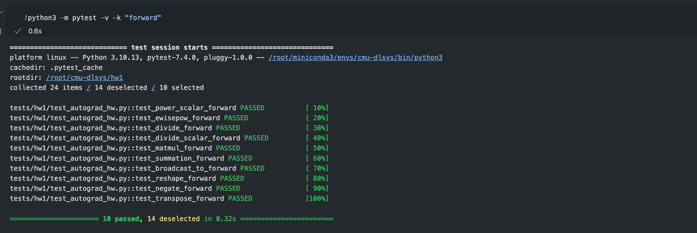

# 深度学习系统从入门到放弃 - CMU-DL System Lab1-1 前向计算和梯度传播

lab1开始正式进入到深度学习系统框架的开发，lab1将帮助你开始实现一个叫 **needle** （**ne**cessary **e**lements of **d**eep **le**arning）库。具体来说，lab1的目标是构建一个基本的**自动微分**框架，然后使用它来重新实现HW0中用于MNIST数字分类问题的简单双层神经网络。

# 什么是Neddle

`needle`是一个基于 `numpy` CPU后端的自动微分库，将在课程中逐步扩展到包含GPU代码的线性代数库。这次作业中，你将使用Python语言来实现自动微分的基础。

在 `needle`库中，有两个重要的文件：`python/needle/autograd.py`（定义了计算图框架的基础，并将成为自动微分框架的基础）和 `python/needle/ops/ops_mathematic.py`（包含各种运算符的实现，你将在作业和课程中使用这些运算符）。

虽然 `autograd.py`文件已经建立了自动微分的基本框架，但你应该熟悉库的基本概念，特别是以下几个定义的类：

- `Value`：在计算图中计算出的值，可以是对其他 `Value`对象应用的操作的输出，或者是常数（叶子）`Value`对象。这里使用了一个通用类（然后专门用于例如张量），以便于以后版本的needle中使用其他数据结构，但目前你主要通过它的子类 `Tensor`（见下文）与这个类交互。
- `Op`：计算图中的一个运算符。运算符需要在 `compute()`方法中定义它们的“前向”过程（即如何在 `Value`对象的底层数据上计算运算符），以及通过 `gradient()`方法定义它们的“反向”过程，即如何乘以传入的输出梯度。如何编写这样的运算符的细节将在下文中给出。
- `Tensor`：`Value`的一个子类，对应于计算图中的实际张量输出，即多维数组。你在这次作业中的所有代码（以及大多数后续作业）都将使用这个 `Value`的子类而不是上面的通用类。我们提供了几个便利函数（例如，操作符重载），让你能够使用正常的Python惯例操作张量，但这些函数在你实现相应操作之前将不会正常工作。
- `TensorOp`：是 `Op`的一个子类，用于返回张量的运算符。你在这次作业中实现的所有操作都将是这种类型。

# 问题1：实现前向计算

问题1中，我们将为多个类实现 `compute`方法以进行前向计算。例如，在 `ops/ops_mathematic.py`文件中的 `EWiseAdd`运算符，它的 `compute()`函数执行的是前向传播计算，即直接计算操作本身，输入为 `NDArray`对象。而 `gradient()`函数负责计算梯度，其参数为 `Tensor`对象，意味着函数内部的任何调用都应该通过 `TensorOp`运算来完成。另外，为了简化操作，定义了辅助函数 `add()`，以便更简洁地实现两个 `Tensor`对象的相加。以下是我们需要实现的运算符的 `compute`方法列表：

- `PowerScalar`：将输入提升至整数（标量）幂级。
- `EWiseDiv`：对输入进行逐元素的真除法（2个输入）。
- `DivScalar`：将输入逐元素地除以一个标量（1个输入，`scalar` - 数字）。
- `MatMul`：对输入进行矩阵乘法（2个输入）。
- `Summation`：在指定轴上对数组元素求和（1个输入，`axes` - 元组）。
- `BroadcastTo`：将数组广播到新的形状（1个输入，`shape` - 元组）。
- `Reshape`：不改变数据的前提下，为数组提供新的形状（1个输入，`shape` - 元组）。
- `Negate`：计算输入的数值负值，逐元素操作（1个输入）。
- `Transpose`：颠倒两个轴的顺序，默认为最后两轴（1个输入，`axes` - 元组）。

需要注意的是，由于在未来的作业中我们将使用 `numpy`以外的后端，这里将 `numpy`作为 `array_api`导入，所以我们需要调用 `array_api.add()`等函数，如果我们想使用典型的 `np.X()`调用的话。

## PowerScalar

`PowerScalar`类的 `compute`方法负责进行前向计算。具体地，它将输入的NDArray `a`提升到 `self.scalar`指定的整数幂。在Python的 `numpy`库中，这一计算可以直接通过 `numpy.power`函数实现。下面是对应的公式：

$$
a^{\text{scalar}}
$$

这里，`a`是输入的多维数组（NDArray），而 `scalar`是一个整数，表示我们要将 `a`的每个元素都提升到的幂次。

在代码中，这个计算被实现如下：

```python
def compute(self, a: NDArray) -> NDArray:
    return numpy.power(a, self.scalar)
```

## EWiseDiv

该类代表的操作是逐元素地将两个节点进行除法运算。

`compute`方法执行前向计算，它接收两个NDArray对象 `a`和 `b`作为输入，并返回它们逐元素相除的结果。逐元素除法意味着输出数组中的每个元素是输入数组对应元素的商。在 `numpy`中，这可以简单地使用 `/`运算符完成。

下面是对应的Markdown格式公式：

$$
a_i / b_i
$$

这里 `a_i`和 `b_i`是数组 `a`和 `b`中的对应元素。在代码中，`compute`方法被实现为：

```python
def compute(self, a, b):
    return a / b
```

## DivScalar

`DivScalar`类实现了将一个张量 `a`的每个元素除以一个标量 `scalar`的操作。这在数学上表示为将张量 `a`的每个元素 `a_i`除以 `scalar`：

$$
\frac{a_i}{\text{scalar}}
$$

在 `compute`方法中，我们使用了这个简单的数学操作。这在代码中被实现为：

```python
def compute(self, a):
    return a / self.scalar
```

这里，`a`是一个NDArray对象，`self.scalar`是初始化 `DivScalar`类时传入的标量值。

## MatMul

`MatMul`类的 `compute`方法实现了两个矩阵 `a`和 `b`之间的矩阵乘法。矩阵乘法是线性代数中的一项基础操作，其中每个元素都是第一个矩阵的行与第二个矩阵的列的点积。在Python中，这可以使用 `@`运算符来简化实现：

$$
\mathbf{C} = \mathbf{A} @ \mathbf{B}
$$

这里，$\mathbf{A}$和$\mathbf{B}$是输入矩阵，$\mathbf{C}$是结果矩阵。在代码中，`compute`方法被实现为：

```python
def compute(self, a, b):
    return a @ b
```

## Summation

`Summation`类实现了对张量进行求和的操作。这个类的方法 `compute`负责执行实际的求和计算。

如果在初始化 `Summation`对象时没有指定 `axes`参数，则默认对张量 `a`的所有元素进行全局求和。如果指定了 `axes`，则仅对指定轴上的元素进行求和。

`compute`方法根据是否指定了 `axes`来决定求和的方式：

- **全局求和**：如果 `self.axes`为 `None`，则对张量 `a`的所有元素进行求和。
- **指定轴求和**：如果指定了 `self.axes`，则只在这些特定的轴上进行求和。

代码实现如下：

```python
def compute(self, a):
    if self.axes is None:
        return array_api.sum(a)
  
    return array_api.sum(a, axis=self.axes)
```

在这段代码中，`array_api.sum`是执行求和操作的函数，`a`是输入的张量，`self.axes`是一个轴的元组，指示了求和操作的维度。

## BroadcastTo

`BroadcastTo`类设计用来扩展张量的形状，使其符合某个新的形状。这种操作在深度学习中常见，如需要将小规模数据扩展以与大规模数据进行操作时。

`compute`方法负责执行实际的广播操作，其使用了 `array_api.broadcast_to`函数。这个函数将输入的张量 `a`扩展到 `self.shape`定义的新形状。

- 如果 `a`的形状可以在不复制数据的前提下扩展到 `self.shape`，则进行广播。
- 如果 `a`的形状不能广播到 `self.shape`，通常会抛出一个异常。

代码实现如下：

```python
def compute(self, a):
    return array_api.broadcast_to(a, shape=self.shape)
```

在这段代码中，`a`是输入的张量，`self.shape`是要广播到的目标形状。通过这种方式，`BroadcastTo`操作允许不同形状的张量在数学运算中兼容。

## Reshape

`Reshape`类用于改变输入张量 `a`的形状而不改变其数据。这在数据预处理或网络层之间传递数据时特别有用，当你需要改变数据的维度以适应特定操作时。`compute`方法执行实际的形状改变操作。它依赖于 `array_api.reshape`函数，该函数接受原始张量 `a`和一个目标形状 `self.shape`作为参数，并返回一个新形状的张量。

代码实现如下：

```python
def compute(self, a):
    return array_api.reshape(a, self.shape)
```

这里，`a`是输入张量，`self.shape`是我们想要 `a`重新塑形成的新形状。`Reshape`操作确保了张量 `a`的总元素数量保持不变，同时允许我们以新的维度排列这些元素。

## Negate

`Negate`类实现了数值取反操作，即将输入张量 `a`中的所有元素的符号颠倒。在数学和编程中，取反是一个基本操作，通常用于改变数值的正负。`compute`方法负责执行取反操作。它使用了 `array_api.negative`函数，这个函数接受输入张量 `a`，并返回一个新张量，新张量的每个元素都是 `a`中对应元素的负值。

代码实现如下：

```python
def compute(self, a):
    return array_api.negative(a)
```

在这段代码中，`a`是输入张量。执行 `array_api.negative(a)`后，我们得到一个新的张量，其中包含了 `a`的数值取反后的结果。这个操作在梯度计算和优化中特别有用，因为它常常涉及到梯度的方向反转。

## Transpose

该操作可以交换多维数组中任意两个轴的位置。它的目的是转置输入的多维数组 `a`。转置操作通常意味着在矩阵（二维数组）中交换行和列，但在多维数组中，转置可以更一般化为交换任意两个维度。

代码首先检查是否有 `self.axes`提供，`self.axes`是一个包含两个元素的元组，指定了需要交换的轴。如果没有提供 `self.axes`，则默认交换数组的最后两个轴。这在多维数组的线性代数操作中是常见的，特别是在执行矩阵乘法时。

如果提供了 `self.axes`，则代码根据提供的轴创建一个新的轴顺序。然后使用 `array_api.transpose`函数执行转置，这个函数接收数组 `a`和轴顺序 `axes_to_use`作为参数。

转置操作可以用下面的伪代码来描述：

```markdown
# 如果未提供axes，使用默认的最后两个轴
if axes is None:
    transpose(a, axes=(-2, -1))
# 如果提供了axes，使用指定的轴
else:
    transpose(a, axes=(axes[0], axes[1]))
```

在实际的Python代码中，这个逻辑是这样实现的：

```python
def compute(self, a):
    if self.axes is None:
        axes_to_use = list(range(a.ndim))
        axes_to_use[-2], axes_to_use[-1] = axes_to_use[-1], axes_to_use[-2]
    else:
        axes_to_use = list(range(a.ndim))
        axes_to_use[self.axes[0]], axes_to_use[self.axes[1]] = axes_to_use[self.axes[1]], axes_to_use[self.axes[0]]
  
    return array_api.transpose(a, axes=axes_to_use)
```

在这段代码中，`a.ndim`表示数组 `a`的维度数，`list(range(a.ndim))`创建了一个从0到 `a.ndim - 1`的整数列表，代表了数组 `a`的原始轴顺序。接下来，通过交换列表中的两个元素，我们得到了新的轴顺序，然后传递给 `array_api.transpose`函数来实际执行转置操作。

## 执行结果

执行全部通过✅



# 问题2：实现反向计算

主要是链式法则
